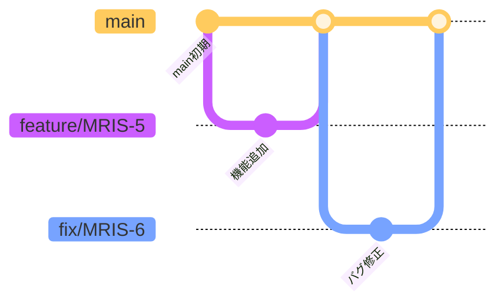

# ChatBot FE

## プロジェクト概要

このプロジェクトは、社内向けチャットボットのフロントエンドです。  
バックエンドからの回答APIと連携し、チャット形式でドキュメントベースのQA機能を提供します。

React + TypeScript + Vite をベースに構築されています。

---

## 前提条件

- **Node.js 24.x 以上を推奨**

  Node.js のバージョン確認：

  ```bash
  node -v
  ```

  出力例：

  ```bash
  v24.2.0
  ```

- **Yarn（パッケージマネージャ）がインストールされていること**

  Yarn のインストール状況を確認：

  ```bash
  yarn -v
  ```

    出力例：

  ```bash
  1.22.22
  ```

  Yarn が未インストールの場合、以下のコマンドでグローバルインストールします：

  ```bash
  npm install -g yarn
  ```

  このコマンドは、Node.js 付属の `npm` を使用して、Yarn を**グローバル環境**（どのプロジェクトでも使える状態）にインストールします。  
  以降、プロジェクトごとの依存管理やスクリプト実行を Yarn で行うことができます。

---


## 環境構築手順

1. リポジトリをクローン

以下は **SSH を使用した場合の例** です。HTTPS を使用する場合は GitHub 上でリポジトリのクローン用 URL を変更してください。

```bash
git clone git@github.com:novel-muraguchi/chatbot-fe.git
cd chatbot-fe
```

2. 依存パッケージをインストール

```bash
yarn install
```

> 初回実行時、`yarn.lock`および node_modulesフォルダが自動生成されます。

3. 開発サーバーを起動

```bash
yarn dev
```

4. ブラウザでアクセス  
   `http://localhost:5173`

---


## GitHub ブランチ運用ルール

### ブランチ一覧と役割

#### `main`
- **概要**：本番環境にデプロイされる安定版コード
- **使用タイミング**：リリース確定時

#### `feature/*`
- **概要**：新機能の開発用ブランチ。通常は`main`ブランチから分岐し、開発が完了したら`main`にマージされる。
- **使用タイミング**：機能実装時

#### `fix/*`
- **概要**：バグ修正用ブランチ。PRのマージ後にバグがあった場合、修正を行うためのブランチ。`main`ブランチから分岐し、修正完了後は `main`ブランチにマージされる。
- **使用タイミング**：バグ修正時

---

### ブランチ命名規則

```
feature/チケット番号
fix/チケット番号
```

#### 例:
- `feature/MRIS-5`
- `fix/MRIS-5`

---

### 使用ルール

#### 運用フロー



#### PR作成ルール
- PRのタイトルに JIRA のチケット番号を含める（例: `[MRIS-5] xxxxxxxx`）
- PRテンプレートに従って概要・影響範囲を記述
- 他者レビューを必ず経由すること

---

### タスクに対するブランチの使用方法

- 各タスクに対して1ブランチを作成
- 作業が完了したら `main` にマージする

---

### 禁止事項

- `main` ブランチに直接 push しない
- 未レビューのコードを merge しない
- 命名規則に従わないブランチ作成

---

### 例外

- 今回のプロジェクトでは developやrelease ブランチは使用せず、feature/* や fix/* などの作業ブランチから main へ直接マージする方針とする

---

